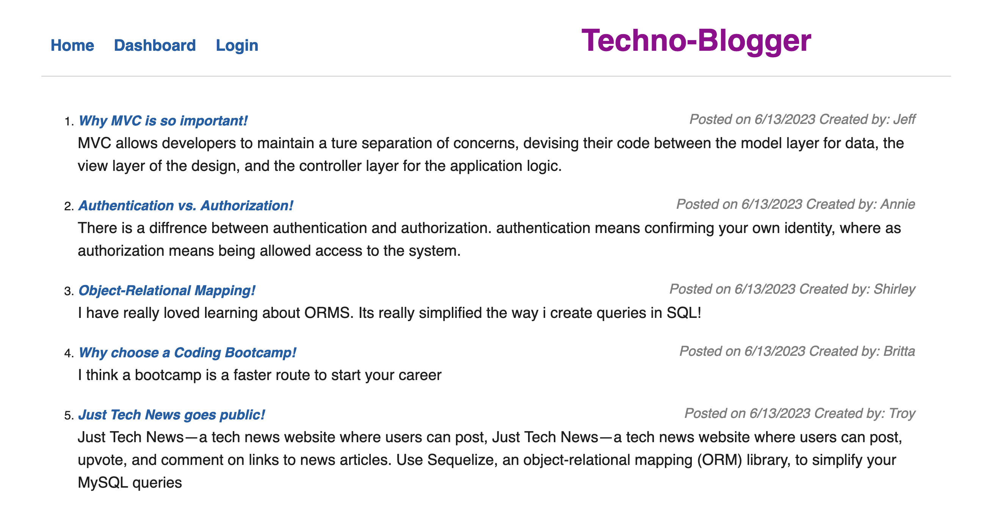

# Techno-Blogger: Model-View-Controller(MVC) 

## Description
    This Application uses Model-View-Controller(MVC) paradigm to create a blog-style app where developers can create an account, edit their information, make or edit posts and comment on other users posts.
    
## Tables of content:
  * [Installation](#installation)
  * [Usage](#usage)
  * [License](#license)
  * [Contributors](#contributors)
  * [Test](#test)
  * [Questions](#questions)

## Installation

1. Install node.js to run this application
2. Create a .gitignore file and include node_modules/ and .DS_Store/ so that your node_modules directory isn't tracked or uploaded to GitHub. Be sure to create your .gitignore file before installing any npm dependencies.
3. Make sure that your repo includes a package.json with the required dependencies. You can create one by running npm init when you first set up the project, before installing any dependencies.
4. Run command npm npm install mysql2 to install mysql package to connect with database and perfrom queries.
5. Run command npm i sequelize to install sequelize package to connect to MYSQL database for Models.
6. Run command npm i express to create Express.js API for controller.
7. Run command npm i express-handlebars to install express-handlebars package to use Handlebars.js for Views.
8. Run command npm i dotenv to install dotenv package to use environment variables.
9. Run command npm i bcrypt to install bcrypt package to hash passwords.
10. Run command npm i express-session and npm i connect-session-sequelize to install  packages to add authentication.
11. Create database and insert data.
12. Run command mysql -u root to be in mysql.
13. Run command source db/schema.sql .
14. Run command source node seeds/index.js.
15. The application will be invoked by using the following command: node server.js.This will start localhost server on PORT 3000.
16. Open browser and type http://localhost:3000 to run this application on your local machine.
17. This application is also deployed in heroku and can be accesed using following url
     https://techno-blogger-mvc.herokuapp.com/

## Usage 

1. App will follow the MVC paradigm in its architectural structure, using Handlebars.js as the templating language, Sequelize as the ORM, and the express-session npm package for authentication.
2. When user visits the site for the first time presented with the homepage, which includes existing blog posts if any have been posted, navigation links for the homepage and the dashboard and the option to log in.
3. When click on any other links in the navigation then prompted to either sign up or login.
4. On sign up, prompted to enter username, email and password. On click of sign up user has been created and signed in to application.
5. On Login, user can enter username and password created during sign up and can log in to the application on next visit.
6. Once logged in, user see navigation links for the homepage, the dashboard, and the option to log out.
7. Click on Home user will be taken to the homepage and presented with existing blog posts that include the post title,content,post creator’s username, and date created for that post.
8. When clicked on existing blog post on home page, user will be presented with the post title, contents, post creator’s username, and date created for that post and have the option to leave a comment.
9. When entered a comment and click on the submit button while signed in, the comment is saved and the post is updated to display the comment, the comment creator’s username, and the date created.
10. On click of dashboard link in the navigation,user is taken to the dashboard and presented with any blog posts that have already created and the option to add a new blog post.
11. On click of new post button user can enter Title and contents for the blog and clik of create button post will be saved.
12. On click on one of my existing posts in the dashboard user will be able to delete or update my post and taken back to an updated dashboard.
13. On click of the logout option in the navigation user will be signed out of the site.
14. If user is idle on the page for 10 mins then he will be automatically signed out of application.

## License  
* This application is licensed under : 
* Click the link for the detailed license information: https://choosealicense.com/licenses/isc/

## Contributors
shruthi

## Test
npm test

## Questions
  * GitHub Username : shruthisalimath
  * Email: shruthi@test.com
  * GitHub profile : https://github.com/shruthisalimath 

## Mock Up

## ScreenShot

## URL
1. The URL of the Deployed Heroku.
   https://techno-blogger-mvc.herokuapp.com/

2. The URL of the GitHub repository.
  https://github.com/shruthisalimath/Techno-Blogger

